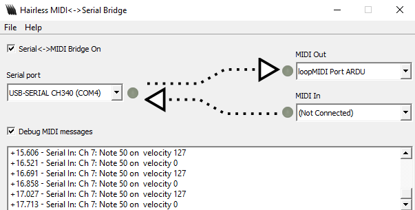
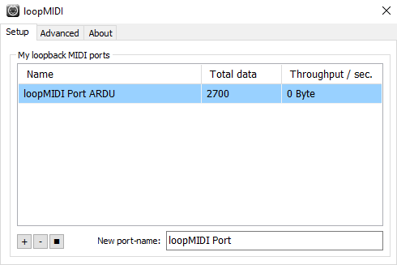
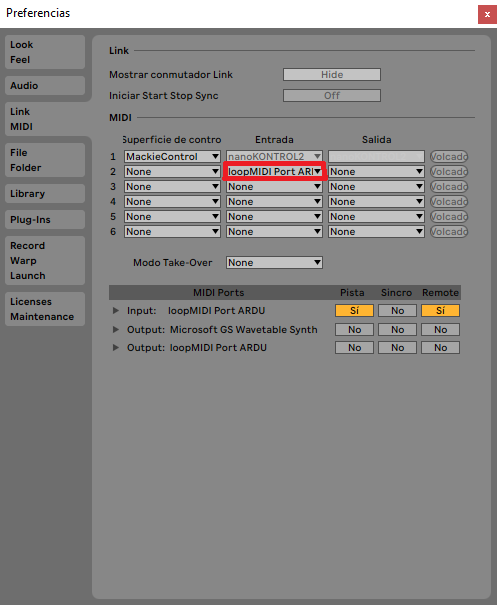
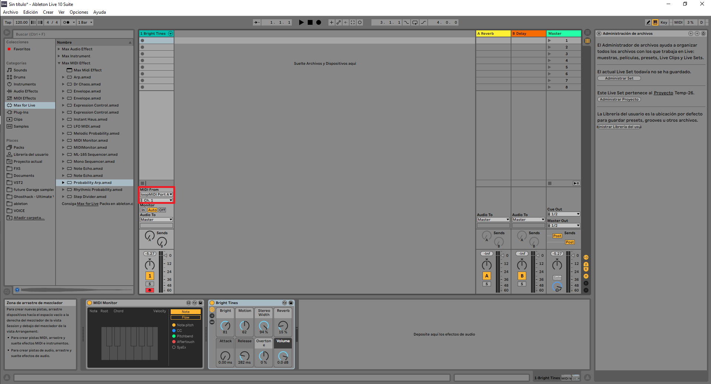

# Circuito-Sonico
Instalación interactiva hecha con sensores de capacitancia, un arduino UNO y Ableton Live, en el marco de la materia Proyecto Audiovisual 1 de la Cátedra Campos-Trilnick de Diseño de Imagen y Sonido, de la UBA.

Registro de la muestra de trabajo en 2019

  

  

Link a registro en video: https://www.youtube.com/watch?v=boJKhoyfTxg&t=77s

La instalación consiste en un dibujo de 120cm x 84cm hecho de grafito colgado de una pared. A este dibujo se conectan unos cables que se conectan
a sensores de capacitancia que estan conectados a un Aruduino UNO. El Arduino detecta los cambios de capacitancia del circuito cuando una persona toca el dibujo.
Al detectar los cambios manda mensajes MIDI a la computadora donde el Programa ABLETON LIVE toma esas señales y reproduce distintos sonidos
segun que sensor se haya tocado. Los sensores de capacitancia tienen la particularidad de que solo es posible tocar uno a la vez, entonces para que suenen dos instrumentos 
es necesario que 2 personas diferentes toquen el dibujo para que suenen los diferentes sonidos. 

Como funciona:

El arduino esta todo el tiempo midiendo la capacitancia de las distintas partes del dibujo que estan atadas a unos sensores de capacitancia con unos
clips cocodrilo. 

Imagen del circuito con el arduino: 

Este circuito en particular tiene 10 sensores de capacitancia. El valor de las resistencias es de 1Millon ohm, pero se puede experimentar con otros valores
de resistencias para que el dibujo sea mas sensible al tacto o menos sensible. El codigo y el esquematico lo adapte de este proyecto:
https://www.instructables.com/Turn-a-pencil-drawing-into-a-capacitive-sensor-for/

Los cables son los sensores de capacitancia. Cuando uno los toca, cambia la capacitancia. Por extención, cuando conecto los sensores al dibujo, se extiende por 
el grafito del dibujo, que tiene la capacidad de conducir la electricidad. 

Al detectar los cambios de capacitancia en los distintos sensores, el arduino manda señales seriales a la computadora. En la computadora 
necesitamos tener andando el programa Hairless midi-serial.
Se ve asi:

Lo podemos descargar gratuitamente de esta pagina web: https://projectgus.github.io/hairless-midiserial/

Como podemos ver Hairless midi-serial lo que hace es convertir las señales Seriales en señales midi. Luego necesitamos abrir
el programa LoopMidi, que se ve así:

y lo podemos descargar de manera gratuita de la siguiente pagina: 
http://www.tobias-erichsen.de/software/loopmidi.html

Lo que hace loopMidi es tomar las señales que le manda el Hairless midi-serial y routearlas en un canal especifico, para que nuestro DAW tome esas señales
como señaes midi provenientes de un dispositivo midi. 

Como siguiente paso vamos a abrir nuestro DAW de elección, en mi caso es ABLETON LIVE. Tenemos que en las configuraciones MIDi, 
elegir a LoopMidi como instrumento de entrada. 

Creamos un canal midi que reciva información de LoopMidi. En este caso corresponde a la información enviada
en el canal 1. Cada canal del 1 al 10 corresponde a cada uno de los 10 sensores del arduino. 

y asi se ve cuando una señal es enviada:

Tener en cuenta que solo es posible enviar una nota a la vez por canal. Como esto puede sonar medio aburrido, lo que
suelo hacer es utilizar plugins que modifiquen la señal midi para generar algo más interesante. 

Ultimas consideraciones:
-Es necesario que el circuito siempre tenga una conección a tierra. Si por ejemplo estamos usando el arduino en una laptop, es necesario que 
la usemos conectada, sino el circuito no va a funcionar. 
-Es posible que si la persona que toca el dibujo esta usando botas o algun otro calzado no funcione el circuito. Algo que yo probe
y funcionó fue pedirle a los participantes que se saquen los zapatos y poner una superficie de madera en el suelo, de esta forma funcionó siempre.
-es posible que el circuito tome señales falseadamente, esto depende de la resistencia que estemos usando y del valor que le demos en el codigo a la variable "touchedCutoff".
-se puede ampliar la cantidad de sensores, incluso si se utiliza otro arduino, se puede poner un sensor por cada Pin Digital que se tenga. 
-Intentar que los instrumentos tengan un balance entre ritmicos y meloodicos.
