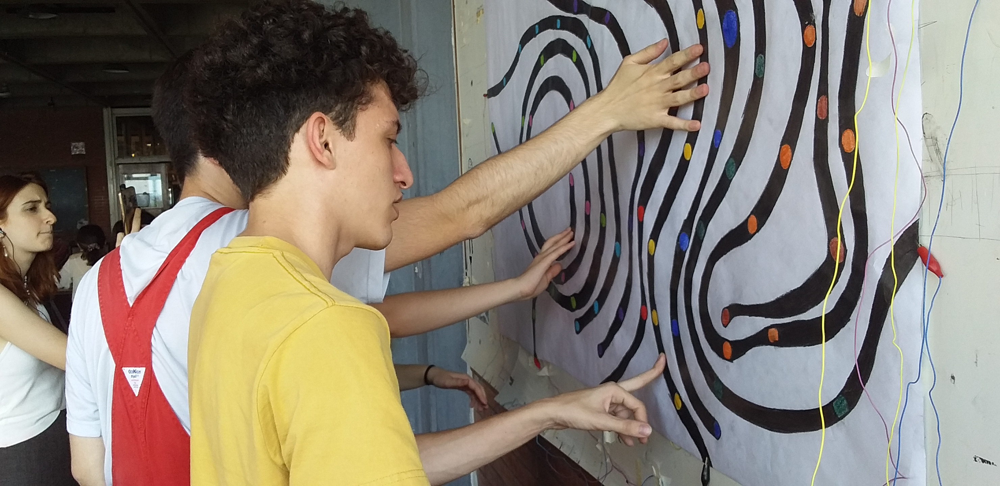
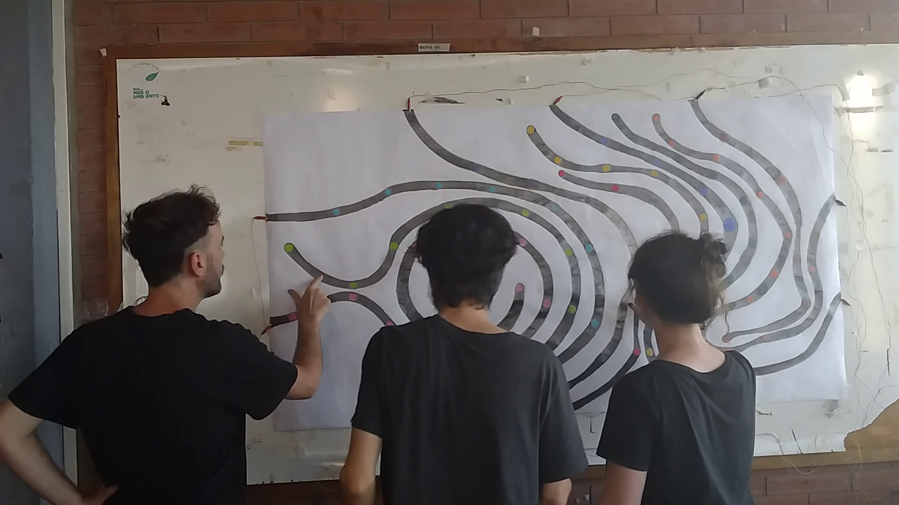
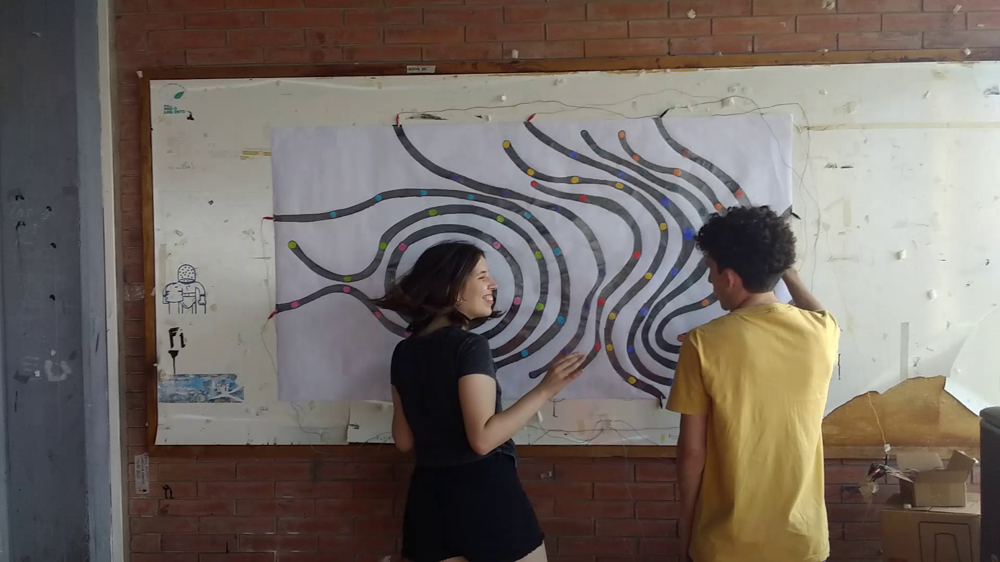
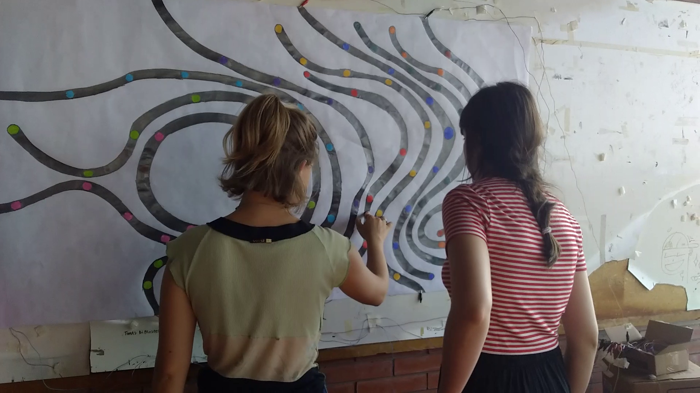
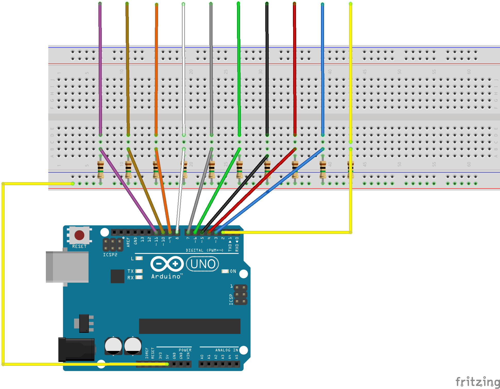

# Circuito-Sonico
Instalación interactiva hecha con sensores de capacitancia, un arduino UNO y Ableton Live, en el marco de la materia Proyecto Audiovisual 1 de la Cátedra Campos-Trilnick de Diseño de Imagen y Sonido, de la UBA.

Registro de la muestra de trabajo en 2019

  

  

Link a registro en video: https://www.youtube.com/watch?v=boJKhoyfTxg&t=77s

La instalación consiste en un dibujo de 120cm x 84cm hecho de grafito colgado de una pared. A este dibujo se conectan unos cables que se conectan
a sensores de capacitancia que estan conectados a un Aruduino UNO. El Arduino detecta los cambios de capacitancia del circuito cuando una persona toca el dibujo.
Al detectar los cambios manda mensajes MIDI a la computadora donde el Programa ABLETON LIVE toma esas señales y reproduce distintos sonidos
segun que sensor se haya tocado. Los sensores de capacitancia tienen la particularidad de que solo es posible tocar uno a la vez, entonces para que suenen dos instrumentos 
es necesario que 2 personas diferentes toquen el dibujo para que suenen los diferentes sonidos. 

Como funciona:

El arduino esta todo el tiempo midiendo la capacitancia de las distintas partes del dibujo que estan atadas a unos sensores de capacitancia con unos
clips cocodrilo. 

Imagen del circuito con el arduino: 

Este circuito en particular tiene 10 sensores de capacitancia. El valor de las resistencias es de 1Millon ohm, pero se puede experimentar con otros valores
de resistencias para que el dibujo sea mas sensible al tacto o menos sensible. El codigo y el esquematico lo adapte de este proyecto:
https://www.instructables.com/Turn-a-pencil-drawing-into-a-capacitive-sensor-for/

Los cables son los sensores de capacitancia. Cuando uno los toca, cambia la capacitancia. Por extención, cuando conecto los sensores al dibujo, se extiende por 
el grafito del dibujo, que tiene la capacidad de conducir la electricidad. 

Al detectar los cambios de capacitancia en los distintos sensores, el arduino manda señales seriales a la computadora. En la computadora 
necesitamos tener andando el programa 
