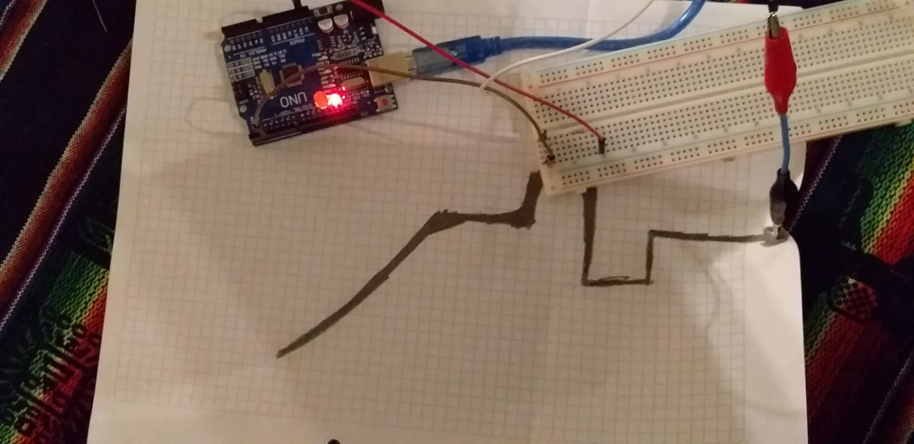

# Circuito-Sonico
Instalación interactiva hecha con sensores de capacitancia, un arduino UNO y Ableton Live, en el marco de la materia Proyecto Audiovisual 1 de la Cátedra Campos-Trilnick de Diseño de Imagen y Sonido, de la UBA.

Registro de la muestra de trabajo en 2019

  

  

La instalación consiste en un dibujo de 120cm x 84cm hecho de grafito colgado de una pared. A este dibujo se conectan unos cables que se conectan
a sensores de capacitancia que estan conectados a un Aruduino UNO. El Arduino detecta los cambios de capacitancia del circuito cuando una persona toca el dibujo.
Al detectar los cambios manda mensajes MIDI a la computadora donde el Programa ABLETON LIVE toma esas señales y reproduce distintos sonidos
segun que sensor se haya tocado. Los sensores de capacitancia tienen la particularidad de que solo es posible tocar uno a la vez, entonces para que suenen dos instrumentos 
es necesario que 2 personas diferentes toquen el dibujo para que suenen los diferentes sonidos. 

Imagen del circuito con el arduino

